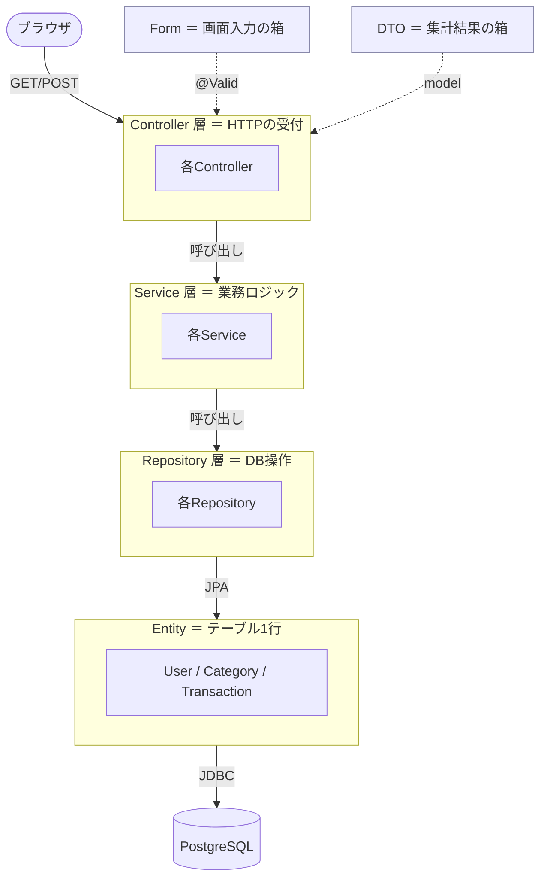
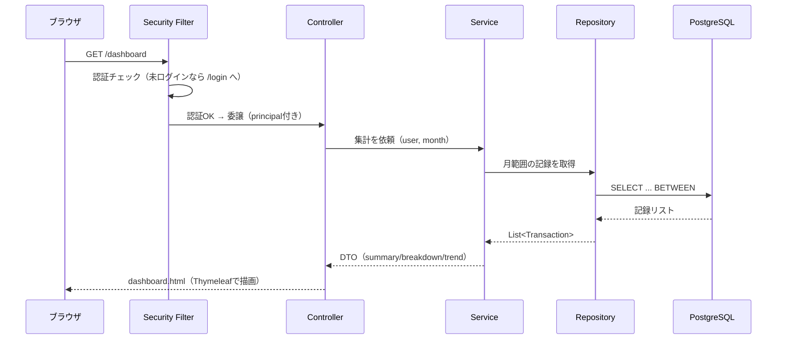
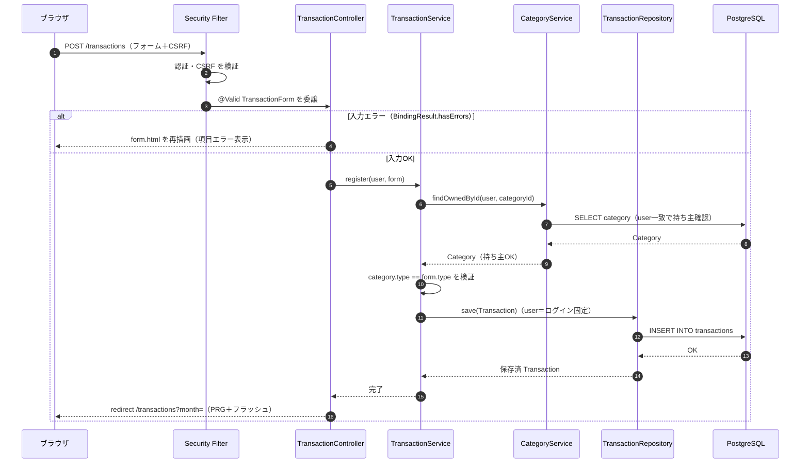
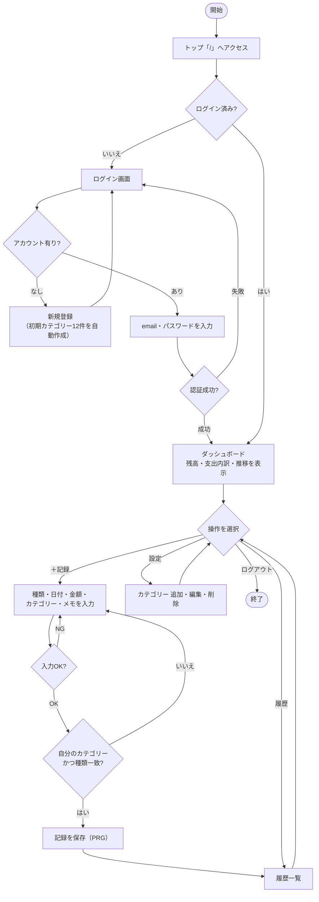
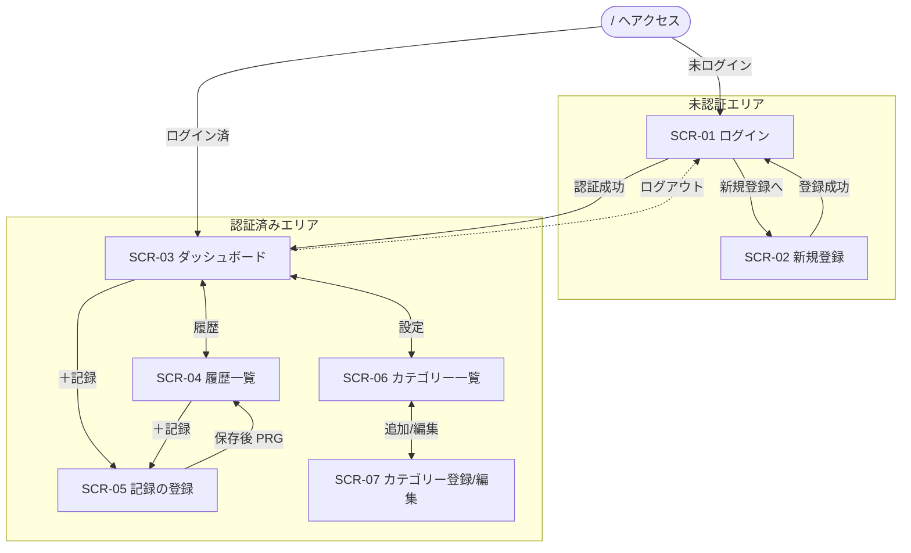

# 📐 第1章 システム構成

[← 目次に戻る](./README.md)

---

## 1-1. 技術スタック

| 区分             | 採用技術                          | バージョン/補足                  |
| ---------------- | --------------------------------- | -------------------------------- |
| 言語             | Java                              | 17（`release 17` でコンパイル）  |
| フレームワーク   | Spring Boot                       | 4.x                              |
| Web/MVC          | Spring Web MVC                    | サーバーサイドレンダリング       |
| テンプレート     | Thymeleaf                         | ＋ thymeleaf-extras-springsecurity6 |
| 認証・認可       | Spring Security                   | フォーム認証／BCrypt／CSRF       |
| ORM              | Spring Data JPA（Hibernate）      | メソッド名規約で検索生成         |
| DB               | PostgreSQL                        | DB名 `expense_tracker`           |
| 入力検証         | Jakarta Bean Validation           | `@NotBlank` 等                   |
| 補助             | Lombok                            | getter/setter/コンストラクタ生成 |
| CSS              | Tailwind CSS（CDN）               | 学習用にCDN読込                  |
| グラフ描画       | Chart.js（CDN）                   | ダッシュボードの円・折れ線グラフ |
| ビルド           | Maven（mvnw）                     | `spring-boot:run` で起動         |

---

## 1-2. レイヤード・アーキテクチャ



| 層 | 責務 | やらないこと |
| -- | ---- | ------------ |
| Controller | URL受付・`@Valid`発動・Service呼び出し・画面名/リダイレクト返却 | SQL・業務ルール・HTML組み立て |
| Service | 業務判断・詰め替え・ハッシュ化・集計・トランザクション境界 | HTTP・SQL |
| Repository | DB入出力（CRUD・検索） | if/for/業務判定 |
| Entity | テーブル1行の「形」 | 業務ロジック |
| Form | 画面入力1件の保持＋入力検証 | DB制約 |
| DTO | 集計結果を画面へ運ぶ | DBと結合 |

---

## 1-3. パッケージ構成

```text
com.example.expensetracker
├── ExpenseTrackerAppApplication.java   … 起動クラス
├── entity/
│   ├── TransactionType.java   … enum（EXPENSE / INCOME）
│   ├── User.java              … users テーブル
│   ├── Category.java          … categories テーブル
│   └── Transaction.java       … transactions テーブル
├── repository/
│   ├── UserRepository.java
│   ├── CategoryRepository.java
│   └── TransactionRepository.java
├── form/
│   ├── LoginForm.java
│   ├── UserRegisterForm.java
│   ├── CategoryForm.java
│   └── TransactionForm.java
├── service/
│   ├── UserService.java         … ハッシュ化・UserDetailsService・初期カテゴリー
│   ├── CategoryService.java
│   └── TransactionService.java  … 集計
├── dto/
│   ├── MonthlySummary.java       … 月合計（収入/支出/残高）
│   ├── CategorySlice.java        … 支出内訳1切れ
│   └── MonthlyTrendPoint.java    … 推移1ヶ月分
├── exception/
│   └── ResourceNotFoundException.java
├── controller/
│   ├── HomeController.java
│   ├── LoginController.java
│   ├── UserRegisterController.java
│   ├── DashboardController.java
│   ├── TransactionController.java
│   └── CategoryController.java
└── config/
    └── SecurityConfig.java
```

```text
src/main/resources/
├── application.properties        … DB接続 / JPA / ポート
└── templates/
    ├── fragments/layout.html     … head / flash / fieldError / globalErrors / bottomNav / appHeader
    ├── auth/login.html
    ├── auth/register.html
    ├── dashboard.html
    ├── transaction/list.html
    ├── transaction/form.html
    ├── category/list.html
    └── category/form.html
```

---

## 1-4. 実行構成・環境設定

| 設定キー | 値 | 意味 |
| -------- | -- | ---- |
| `spring.datasource.url` | `jdbc:postgresql://localhost:5433/expense_tracker` | 接続先DB |
| `spring.datasource.username` | `postgres` | DBユーザー |
| `spring.datasource.password` | `123456` | DBパスワード（環境に合わせ変更） |
| `spring.jpa.hibernate.ddl-auto` | `update` | 起動時にEntityからテーブルを差分更新（学習用） |
| `spring.jpa.show-sql` | `true` | 実行SQLをログ出力 |
| `server.port` | `8080` | 待ち受けポート |

### 起動手順

```bash
# 1. DB作成（初回のみ）
psql -U postgres -c "CREATE DATABASE expense_tracker;"

# 2. 起動（Windows）
mvnw.cmd spring-boot:run

# 3. アクセス
#   http://localhost:8080/  → 未ログインなら /login へ
```

> 📌 `ddl-auto=update` は学習用。本番は `validate` ＋ Flyway/Liquibase を推奨。

---

## 1-5. 処理の一往復（リクエストの流れ）



## 1-6. シーケンス図（記録登録の一連の流れ）

代表的な更新系ユースケースとして「記録の登録（FNC-09）」を、ブラウザ〜DBの往復で示す。
※詳細な条件分岐は [06_処理設計 6-4](./06_処理設計.md) を参照。



---

## 1-7. アクティビティ図（利用者の操作フロー）

アプリ利用開始からログアウトまでの、利用者から見た行動の流れ。ひし形は判断、角丸は開始/終了。



---

## 1-8. 画面遷移図（全体像）

認証状態で画面群を分けた俯瞰図。画面ごとの項目や個別イベントは [02_画面設計 2-2](./02_画面設計.md) を参照。



---

[← 目次](./README.md) ｜ [次へ：02 画面設計 →](./02_画面設計.md)
