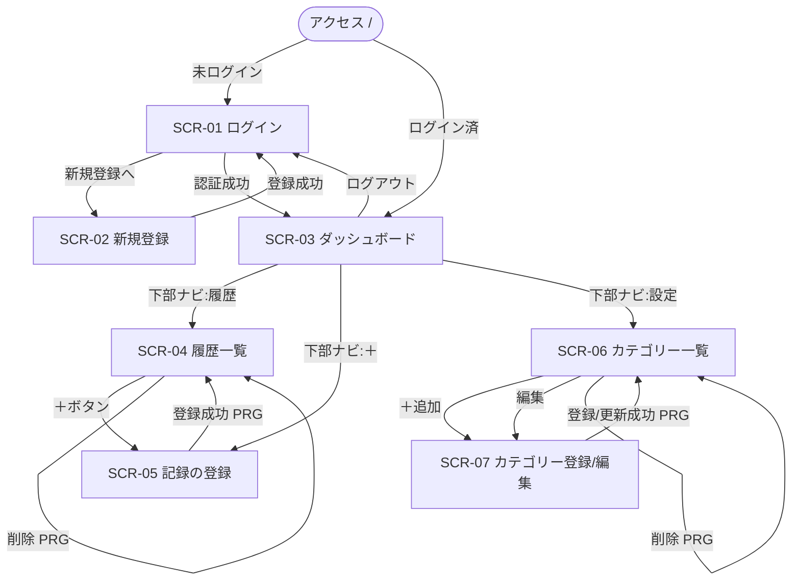

# 📐 第2章 画面設計

[← 目次に戻る](./README.md)

---

## 2-1. 画面一覧

| 画面ID | 画面名             | URL（GET）            | テンプレート              | 認証 |
| ------ | ------------------ | --------------------- | ------------------------- | ---- |
| SCR-01 | ログイン           | `/login`              | `auth/login.html`         | 不要 |
| SCR-02 | 新規登録           | `/register`           | `auth/register.html`      | 不要 |
| SCR-03 | ダッシュボード     | `/dashboard`          | `dashboard.html`          | 必要 |
| SCR-04 | 履歴一覧           | `/transactions`       | `transaction/list.html`   | 必要 |
| SCR-05 | 記録の登録         | `/transactions/new`   | `transaction/form.html`   | 必要 |
| SCR-06 | カテゴリー一覧     | `/categories`         | `category/list.html`      | 必要 |
| SCR-07 | カテゴリー登録/編集 | `/categories/new`<br/>`/categories/{id}/edit` | `category/form.html` | 必要 |

> SCR-07 は1テンプレートで登録/編集を兼用（`isEdit` フラグで切替）。

---

## 2-2. 画面遷移図



### 共通遷移ルール

- **未認証で要認証画面にアクセス** → 自動で SCR-01 へリダイレクト
- **更新系POSTの成功後** → 必ずリダイレクト（PRG）。一覧へ戻りフラッシュメッセージ表示
- **ログアウト**（POST `/logout`） → `/login?logout` へ

---

## 2-3. 共通レイアウト

| 部品              | 配置             | 内容                                            |
| ----------------- | ---------------- | ----------------------------------------------- |
| `appHeader`       | 上部固定         | 利用者名「○○さん」＋ログアウトボタン（要認証画面） |
| `flash`           | 本文上部         | 成功＝緑バナー / エラー＝赤バナー（1回限り）     |
| `globalErrors`    | フォーム上部     | フォーム全体エラー（重複等）                    |
| `bottomNav`       | 下部固定         | 🏠ホーム / 📋履歴 / ＋記録 / ⚙️設定（現在地を色付け） |

---

## 2-4. 画面項目定義

> 「必須」「桁」「形式」の検証内容は [07_バリデーション定義.md](./07_バリデーション定義.md) と対応。
> `th:field` は対応する Form のフィールド名と一致させる。
> 各画面のレイアウト（画面イメージ）は本章 **2-5 画面ワイヤーフレーム** を参照。

### SCR-01 ログイン（`LoginForm`）

| 項目     | 種別        | th:field      | 必須 | 備考                          |
| -------- | ----------- | ------------- | ---- | ----------------------------- |
| メールアドレス | text(email) | `*{email}`   | ○    | 形式チェックあり              |
| パスワード | password    | `*{password}` | ○    |                               |
| ログイン | button(submit) | ―          | ―    | POST `/login`（Securityが処理）|

イベント／表示制御：
- `?error` 付き遷移時 → 「メールアドレスまたはパスワードが間違っています」を赤表示
- `?logout` 付き遷移時 → 「ログアウトしました」を緑表示
- 「新規登録はこちら」リンク → SCR-02

### SCR-02 新規登録（`UserRegisterForm`）

| 項目     | 種別     | th:field      | 必須 | 桁/形式            |
| -------- | -------- | ------------- | ---- | ------------------ |
| ユーザー名 | text     | `*{name}`     | ○    | 最大100            |
| メールアドレス | email | `*{email}`    | ○    | email形式・最大255 |
| パスワード | password | `*{password}` | ○    | 6〜255文字         |
| 登録ボタン | button   | ―             | ―    | POST `/register`   |

イベント：登録成功 → SCR-01 へ（フラッシュ「登録が完了しました。ログインしてください。」）

### SCR-03 ダッシュボード（表示専用）

| 区画           | 表示内容                                               | データ元（model属性） |
| -------------- | ------------------------------------------------------ | --------------------- |
| 月セレクタ     | 直近12ヶ月。選択で `?month=` 付き再読込                 | `availableMonths` / `selectedMonth` |
| 残高カード     | 残高（≥0で青、<0で赤）                                 | `summary.balance`     |
| 収入カード     | 収入合計                                               | `summary.income`      |
| 支出カード     | 支出合計                                               | `summary.expense`     |
| 支出の内訳     | **円グラフ（ドーナツ）**。カテゴリー別の色・金額・割合%。0件は案内表示。Chart.js描画 | `breakdown`（List<CategorySlice>）|
| 直近6ヶ月の推移 | **折れ線グラフ**。収入(緑線)・支出(赤線)の2系列。縦軸はChart.jsが自動スケール | `trend`（List<MonthlyTrendPoint>）|

### SCR-04 履歴一覧（表示＋削除）

| 区画       | 表示内容                                              | データ元 |
| ---------- | ----------------------------------------------------- | -------- |
| 月セレクタ | 直近12ヶ月。`?month=` で切替                           | `availableMonths` / `selectedMonth` |
| 記録カード（繰返） | カテゴリー色アイコン(先頭1字)・カテゴリー名・取引日・メモ・金額（収入は緑＋符号）・削除ボタン | `transactions`（List<Transaction>）|
| 0件時      | 「記録がありません」案内                              | ―        |

イベント：削除ボタン → POST `/transactions/{id}/delete`（`month` をhidden送信、`confirm`あり）

### SCR-05 記録の登録（`TransactionForm`）

| 項目         | 種別            | th:field            | 必須 | 備考                                    |
| ------------ | --------------- | ------------------- | ---- | --------------------------------------- |
| 種類トグル   | link(支出/収入) | `*{type}`(hidden)   | ○    | リンクで `?type=` 切替＝カテゴリーも切替 |
| 日付         | date            | `*{transactionDate}`| ○    | 初期値＝今日                            |
| 金額         | number          | `*{amount}`         | ○    | 1以上                                   |
| カテゴリー   | radio(ボタン風) | `*{categoryId}`     | ○    | 選択中の種類のカテゴリーのみ表示        |
| メモ         | text            | `*{memo}`           | ―    | 最大255（任意）                         |
| 記録ボタン   | button          | ―                   | ―    | POST `/transactions`                    |

イベント：登録成功 → SCR-04（その記録の月）へ。カテゴリー0件時は設定への案内表示。

### SCR-06 カテゴリー一覧（表示＋削除）

| 区画                 | 表示内容                                  | データ元 |
| -------------------- | ----------------------------------------- | -------- |
| 支出カテゴリーカード | 色丸・名前・編集・削除（繰返）＋「＋追加」 | `expenseCategories` |
| 収入カテゴリーカード | 同上                                      | `incomeCategories`  |

イベント：
- 「＋追加」→ SCR-07（`?type=EXPENSE/INCOME`）
- 「編集」→ SCR-07（`/{id}/edit`）
- 「削除」→ POST `/categories/{id}/delete`（`confirm`あり。使用中はエラーバナー）

### SCR-07 カテゴリー登録/編集（`CategoryForm`）

| 項目         | 種別            | th:field      | 必須 | 備考                            |
| ------------ | --------------- | ------------- | ---- | ------------------------------- |
| id           | hidden          | `*{id}`       | ―    | 編集時のみ送信                  |
| type         | hidden          | `*{type}`     | ○    | 一覧の「＋追加」/既存値で確定    |
| カテゴリー名 | text            | `*{label}`    | ○    | 最大100                         |
| カラー       | radio(色パレット) | `*{color}`  | ○    | 12色から選択                    |
| 登録/更新ボタン | button       | ―             | ―    | POST `/categories` or `/{id}/edit` |

表示制御：`isEdit` でタイトル・ボタン文言・action先・id送信を切替。

---

## 2-5. 画面ワイヤーフレーム（画面イメージ）

各画面のレイアウト俯瞰。**モバイル縦画面**を想定。項目の型・必須・桁は本章 **2-4** と対応。

> 凡例：`│`＝画面の左端、`├──┤`＝上部ヘッダー／下部ナビの区切り、`[____]`＝入力欄、
> `[ ラベル ]`＝ボタン、`●/○`＝選択中/未選択、`▼`＝セレクタ、`⚠`＝エラーバナー、`🗑`＝削除。

### SCR-01 ログイン

```text
╭─ SCR-01 ログイン（/login・認証不要）─────────╮
│
│        📊 スマート家計簿
│
│  ⚠ メールまたはパスワードが違います   ← ?error時（赤）
│
│  メールアドレス
│  [________________________]
│  パスワード
│  [________________________]
│
│  [        ログイン        ]   → POST /login
│
│  ─ 新規登録はこちら →  （SCR-02）
╰──────────────────────────────────────╯
```

### SCR-02 新規登録

```text
╭─ SCR-02 新規登録（/register・認証不要）───────╮
│
│        新規登録
│
│  ⚠ このメールアドレスは登録済みです   ← globalErrors（赤）
│
│  ユーザー名（最大100）
│  [________________________]
│  メールアドレス（email形式）
│  [________________________]
│  パスワード（6〜255文字）
│  [________________________]
│
│  [         登録         ]   → POST /register
│
│  ← ログインへ戻る  （SCR-01）
╰──────────────────────────────────────╯
```

### SCR-03 ダッシュボード

```text
╭─ SCR-03 ダッシュボード（/dashboard）──────────╮
│  Akemiさん                    [ログアウト]   ← appHeader
├──────────────────────────────────────────┤
│  ◀  2026年 6月 ▼  ▶            ← 月セレクタ（直近12ヶ月）
│
│  ┌── 残高 ─────────────┐
│  │        ¥ 12,000      │   ← ≥0:青 / <0:赤
│  └─────────────────────┘
│  ┌ 収入 ────┐  ┌ 支出 ────┐
│  │ ¥50,000  │  │ ¥38,000  │
│  └──────────┘  └──────────┘
│
│  支出の内訳
│  ┌─────────────────────┐
│  │      ◕  円グラフ      │   ← Chart.js doughnut
│  │   食費40% 住居30% …   │      （0件は案内表示）
│  └─────────────────────┘
│  直近6ヶ月の推移
│  ┌─────────────────────┐
│  │    ╱╲__╱‾  折れ線     │   ← 収入(緑)/支出(赤)
│  └─────────────────────┘
├──────────────────────────────────────────┤
│  [🏠 ホーム]  📋履歴   ＋記録   ⚙️設定    ← bottomNav（現在地=ホーム）
╰──────────────────────────────────────────╯
```

### SCR-04 履歴一覧

```text
╭─ SCR-04 履歴一覧（/transactions）────────────╮
│  Akemiさん                    [ログアウト]
├──────────────────────────────────────────┤
│  ◀  2026年 6月 ▼  ▶
│
│  ┌─────────────────────────────┐
│  │ (食) 食費         6/20        │  ← 色アイコン＋カテゴリ名＋日付
│  │      ランチ          -¥1,200 🗑│  ← メモ / 金額 / 削除
│  └─────────────────────────────┘
│  ┌─────────────────────────────┐
│  │ (給) 給与         6/25        │
│  │                  +¥50,000 🗑│  ← 収入は緑＋符号
│  └─────────────────────────────┘
│     （0件時：「記録がありません」）
├──────────────────────────────────────────┤
│  🏠ホーム  [📋 履歴]   ＋記録   ⚙️設定
╰──────────────────────────────────────────╯
   🗑 = POST /transactions/{id}/delete（confirm確認）
```

### SCR-05 記録の登録

```text
╭─ SCR-05 記録の登録（/transactions/new）───────╮
│  ←  記録の登録
│
│  ┌ 支出 ●┐┌ 収入 ○┐        ← 種類トグル（?type=で切替・
│  └───────┘└───────┘             カテゴリーも連動）
│  日付
│  [ 2026/06/20 ]      ← 初期値=今日
│  金額
│  [ ¥ ________ ]      ← 1以上
│  カテゴリー（選択中の種類のみ表示）
│  (●食費) (○住居費) (○交通費) …   ← ラジオ（ボタン風）
│  メモ（任意・最大255）
│  [________________________]
│
│  [         記録         ]   → POST /transactions
│      （カテゴリー0件時は設定への案内を表示）
╰──────────────────────────────────────────╯
```

### SCR-06 カテゴリー一覧

```text
╭─ SCR-06 カテゴリー一覧（/categories）─────────╮
│  Akemiさん                    [ログアウト]
├──────────────────────────────────────────┤
│  支出カテゴリー
│  ┌──────────────────────────────┐
│  │ ● 食費               [編集] [🗑] │
│  │ ● 住居費             [編集] [🗑] │
│  │ ＋ 追加  → SCR-07（?type=EXPENSE）│
│  └──────────────────────────────┘
│  収入カテゴリー
│  ┌──────────────────────────────┐
│  │ ● 給与               [編集] [🗑] │
│  │ ＋ 追加  → SCR-07（?type=INCOME） │
│  └──────────────────────────────┘
│  ⚠ 使用中のカテゴリーは削除できません   ← errorMessage（赤）
├──────────────────────────────────────────┤
│  🏠ホーム  📋履歴   ＋記録   [⚙️ 設定]
╰──────────────────────────────────────────╯
   🗑 = POST /categories/{id}/delete（confirm確認）
```

### SCR-07 カテゴリー登録/編集

```text
╭─ SCR-07 カテゴリー登録/編集（/categories/new・/{id}/edit）╮
│  ←  カテゴリーを追加  ／  カテゴリーを編集    ← isEditで切替
│
│  ⚠ 同じ名前のカテゴリーが既にあります    ← globalErrors（赤）
│
│  種類： 支出              ← hidden（更新時は変更不可）
│  カテゴリー名（最大100）
│  [ 食費____________ ]
│  カラー（12色から選択）
│   ● ● ● ● ● ●         ← ラジオ色パレット
│   ● ● ● ● ● ●
│
│  [      登録 ／ 更新      ]   → POST /categories or /{id}/edit
╰──────────────────────────────────────────────────╯
```

---

[← 01 システム構成](./01_システム構成.md) ｜ [次へ：03 機能一覧 →](./03_機能一覧.md)
