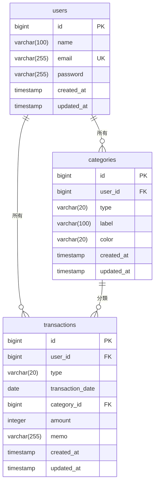

# 📐 第4章 DB設計（物理）

[← 目次に戻る](./README.md)

DBは PostgreSQL。テーブルは Entity から `ddl-auto=update` で自動生成されるが、
本章ではその **確定仕様** を物理設計として明記する。

---

## 4-1. ER図



### リレーション

| 親         | 子            | 多重度 | 外部キー                 | 削除時の挙動（設計） |
| ---------- | ------------- | ------ | ------------------------ | -------------------- |
| users      | categories    | 1 : N  | categories.user_id       | アプリ上、利用者削除は未提供 |
| users      | transactions  | 1 : N  | transactions.user_id     | 同上                 |
| categories | transactions  | 1 : N  | transactions.category_id | 使用中カテゴリーは削除不可（アプリで制御） |

---

## 4-2. テーブル定義

### 4-2-1. users（利用者）

| 物理名      | 論理名       | 型           | NULL | KEY | 既定/制約          | 備考                       |
| ----------- | ------------ | ------------ | ---- | --- | ------------------ | -------------------------- |
| id          | 利用者ID     | BIGSERIAL    | NO   | PK  | 自動採番(IDENTITY) |                            |
| name        | 表示名       | VARCHAR(100) | NO   |     |                    | React版 displayName        |
| email       | メールアドレス | VARCHAR(255) | NO   | UK  | UNIQUE             | ログインID                 |
| password    | パスワード   | VARCHAR(255) | NO   |     |                    | ★BCryptハッシュ（約60字）★ 生は保存しない |
| created_at  | 作成日時     | TIMESTAMP    | NO   |     | 更新不可           | `@PrePersist` で自動セット |
| updated_at  | 更新日時     | TIMESTAMP    | NO   |     |                    | `@PreUpdate` で自動更新     |

### 4-2-2. categories（カテゴリー）

| 物理名      | 論理名       | 型           | NULL | KEY | 既定/制約          | 備考                       |
| ----------- | ------------ | ------------ | ---- | --- | ------------------ | -------------------------- |
| id          | カテゴリーID | BIGSERIAL    | NO   | PK  | 自動採番           |                            |
| user_id     | 利用者ID     | BIGINT       | NO   | FK  | → users(id)        | 所有者                     |
| type        | 種類         | VARCHAR(20)  | NO   |     | 'EXPENSE'/'INCOME' | enum文字列保存             |
| label       | カテゴリー名 | VARCHAR(100) | NO   |     |                    | 例: 食費                   |
| color       | 表示色       | VARCHAR(20)  | NO   |     |                    | 例: #f87171                |
| created_at  | 作成日時     | TIMESTAMP    | NO   |     | 更新不可           |                            |
| updated_at  | 更新日時     | TIMESTAMP    | NO   |     |                    |                            |

業務制約（アプリで担保）：同一 user_id ＋ type 内で label は重複不可。

### 4-2-3. transactions（記録）

| 物理名           | 論理名     | 型           | NULL | KEY | 既定/制約          | 備考                 |
| ---------------- | ---------- | ------------ | ---- | --- | ------------------ | -------------------- |
| id               | 記録ID     | BIGSERIAL    | NO   | PK  | 自動採番           |                      |
| user_id          | 利用者ID   | BIGINT       | NO   | FK  | → users(id)        | 所有者               |
| type             | 種類       | VARCHAR(20)  | NO   |     | 'EXPENSE'/'INCOME' | enum文字列保存       |
| transaction_date | 取引日     | DATE         | NO   |     |                    | 時刻なし(LocalDate)  |
| category_id      | カテゴリーID | BIGINT     | NO   | FK  | → categories(id)   | 分類                 |
| amount           | 金額       | INTEGER      | NO   |     | 1以上(アプリ制御)  | 円・整数             |
| memo             | メモ       | VARCHAR(255) | YES  |     |                    | 任意                 |
| created_at       | 作成日時   | TIMESTAMP    | NO   |     | 更新不可           | 一覧の並び順にも使用 |
| updated_at       | 更新日時   | TIMESTAMP    | NO   |     |                    |                      |

業務制約（アプリで担保）：transaction.type と category.type は一致必須。

---

## 4-3. インデックス設計（推奨）

`ddl-auto` ではPK/UNIQUE/FKに対応するインデックスのみ自動生成される。
検索性能のため、本番では以下の追加を推奨する。

| 対象テーブル | 列                                  | 目的                          |
| ------------ | ----------------------------------- | ----------------------------- |
| transactions | (user_id, transaction_date)         | 月範囲検索の高速化（主要クエリ）|
| transactions | (category_id)                       | 削除前の使用件数カウント       |
| categories   | (user_id, type)                     | 種類別カテゴリー一覧           |

> ※ FNC-07/06 の主要クエリは
> `WHERE user_id=? AND transaction_date BETWEEN ? AND ? ORDER BY transaction_date DESC, id DESC`。
> 複合インデックス (user_id, transaction_date) が効く。

---

## 4-4. 初期データ（マスタ）

### 4-4-1. 利用者登録時に自動作成される初期カテゴリー（計12件）

新規登録（FNC-05）成功時、`UserService` が以下を当該ユーザーに作成する。

| # | type    | label      | color   |
| - | ------- | ---------- | ------- |
| 1 | EXPENSE | 食費       | #f87171 |
| 2 | EXPENSE | 住居費     | #60a5fa |
| 3 | EXPENSE | 水道光熱費 | #fbbf24 |
| 4 | EXPENSE | 交通費     | #34d399 |
| 5 | EXPENSE | 交際・娯楽 | #a78bfa |
| 6 | EXPENSE | 日用品     | #f472b6 |
| 7 | EXPENSE | 医療費     | #2dd4bf |
| 8 | EXPENSE | その他     | #9ca3af |
| 9 | INCOME  | 給与       | #3b82f6 |
| 10| INCOME  | お小遣い   | #10b981 |
| 11| INCOME  | ボーナス   | #f59e0b |
| 12| INCOME  | その他     | #8b5cf6 |

### 4-4-2. カラーパレット（カテゴリー編集で選択可能な12色）

```text
#f87171  #f97316  #fbbf24  #34d399  #2dd4bf  #38bdf8
#818cf8  #a78bfa  #f472b6  #9ca3af  #4ade80  #60a5fa
```

---

## 4-5. DDL（参考・PostgreSQL）

> `ddl-auto=update` で自動生成されるため手動DDLは不要だが、確認用に等価DDLを示す。

```sql
CREATE TABLE users (
    id          BIGSERIAL    PRIMARY KEY,
    name        VARCHAR(100) NOT NULL,
    email       VARCHAR(255) NOT NULL UNIQUE,
    password    VARCHAR(255) NOT NULL,
    created_at  TIMESTAMP    NOT NULL,
    updated_at  TIMESTAMP    NOT NULL
);

CREATE TABLE categories (
    id          BIGSERIAL    PRIMARY KEY,
    user_id     BIGINT       NOT NULL REFERENCES users(id),
    type        VARCHAR(20)  NOT NULL,
    label       VARCHAR(100) NOT NULL,
    color       VARCHAR(20)  NOT NULL,
    created_at  TIMESTAMP    NOT NULL,
    updated_at  TIMESTAMP    NOT NULL
);

CREATE TABLE transactions (
    id               BIGSERIAL    PRIMARY KEY,
    user_id          BIGINT       NOT NULL REFERENCES users(id),
    type             VARCHAR(20)  NOT NULL,
    transaction_date DATE         NOT NULL,
    category_id      BIGINT       NOT NULL REFERENCES categories(id),
    amount           INTEGER      NOT NULL,
    memo             VARCHAR(255),
    created_at       TIMESTAMP    NOT NULL,
    updated_at       TIMESTAMP    NOT NULL
);

-- 推奨インデックス
CREATE INDEX idx_tx_user_date ON transactions(user_id, transaction_date);
CREATE INDEX idx_tx_category  ON transactions(category_id);
CREATE INDEX idx_cat_user_type ON categories(user_id, type);
```

---

[← 03 機能一覧](./03_機能一覧.md) ｜ [次へ：05 クラス設計 →](./05_クラス設計.md)
