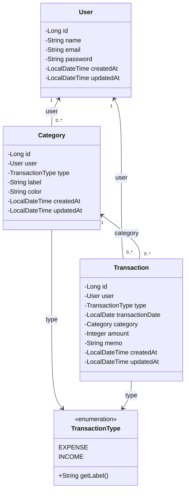
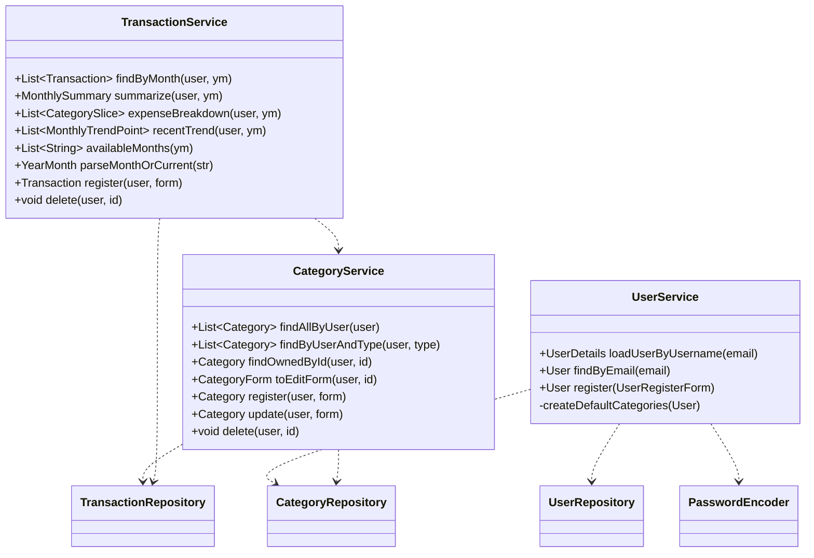

# 📐 第5章 クラス設計

[← 目次に戻る](./README.md)

Entity / Form / DTO / Service / Repository の構造を定義する。
Controller のメソッド仕様は [03_機能一覧.md](./03_機能一覧.md)、処理内容は [06_処理設計.md](./06_処理設計.md) を参照。

---

## 5-1. Entity クラス図

### Entity 共通仕様

| 項目             | 仕様                                              |
| ---------------- | ------------------------------------------------- |
| 主キー           | `Long id` ＋ `@GeneratedValue(IDENTITY)`          |
| 関連             | `@ManyToOne(fetch = LAZY)` ＋ `@JoinColumn`        |
| enum 永続化      | `@Enumerated(EnumType.STRING)`                    |
| 日時自動セット   | `@PrePersist`（created/updated）/ `@PreUpdate`（updated）|
| Lombok           | `@Getter` `@Setter` `@NoArgsConstructor`          |

> フィールドの型・桁・NULL可否は [04_DB設計.md](./04_DB設計.md) のテーブル定義と1対1で対応。

---

## 5-2. Form クラス

| Form               | フィールド（型）                                                       | 用途 |
| ------------------ | ---------------------------------------------------------------------- | ---- |
| `LoginForm`        | email(String), password(String)                                        | SCR-01 |
| `UserRegisterForm` | name(String), email(String), password(String)                          | SCR-02 |
| `CategoryForm`     | id(Long), type(TransactionType), label(String), color(String)          | SCR-07 登録/編集兼用 |
| `TransactionForm`  | type(TransactionType), transactionDate(LocalDate), categoryId(**Long**), amount(Integer), memo(String) | SCR-05 |

### ★設計の要点★ Form と Entity の関連の持ち方

| 関連          | Entity           | Form              |
| ------------- | ---------------- | ----------------- |
| カテゴリー    | `Category category`（オブジェクト） | `Long categoryId`（ID） |

- Form は **ID（Long）** で関連を持つ（画面の `<select value>` と直結）
- Service が `categoryId → Category` に変換する（[06_処理設計.md](./06_処理設計.md) FNC-09）

バリデーション内容は [07_バリデーション定義.md](./07_バリデーション定義.md) を参照。

---

## 5-3. DTO クラス（集計結果の箱）

| DTO                | フィールド                          | 生成元 |
| ------------------ | ----------------------------------- | ------ |
| `MonthlySummary`   | income(int), expense(int), balance(int) | TransactionService#summarize |
| `CategorySlice`    | label(String), color(String), amount(int), percentage(int) | #expenseBreakdown |
| `MonthlyTrendPoint`| label(String), income(int), expense(int) | #recentTrend |

- いずれも `@Getter @AllArgsConstructor`（不変の運び箱）
- Entity ではない（DBと結合しない）。画面に必要な形へ整形して Controller に返す

---

## 5-4. Repository インターフェース

| Repository              | 継承                          | 追加メソッド |
| ----------------------- | ----------------------------- | ------------ |
| `UserRepository`        | `JpaRepository<User, Long>`   | `findByEmail`(Optional), `existsByEmail` |
| `CategoryRepository`    | `JpaRepository<Category, Long>` | `findByUserOrderByIdAsc`, `findByUserAndTypeOrderByIdAsc`, `existsByUserAndTypeAndLabel` |
| `TransactionRepository` | `JpaRepository<Transaction, Long>` | `findByUserAndTransactionDateBetweenOrderByTransactionDateDescIdDesc`, `countByCategory` |

---

## 5-5. Service クラスの責務と公開メソッド

### Service 共通仕様

| 項目         | 仕様                                                       |
| ------------ | ---------------------------------------------------------- |
| クラス注釈   | `@Service` ＋ `@Transactional(readOnly = true)` ＋ `@RequiredArgsConstructor` |
| 依存注入     | `private final` ＋ コンストラクタインジェクション          |
| 書き込み系   | `register` / `update` / `delete` に `@Transactional` を明示 |
| 持ち主チェック | `findOwnedById` / `delete` で「ログイン中ユーザーのものか」検証 |
| 例外         | 引数不正→`IllegalArgumentException`／状態不正→`IllegalStateException`／不在→`ResourceNotFoundException` |

---

[← 04 DB設計](./04_DB設計.md) ｜ [次へ：06 処理設計 →](./06_処理設計.md)
