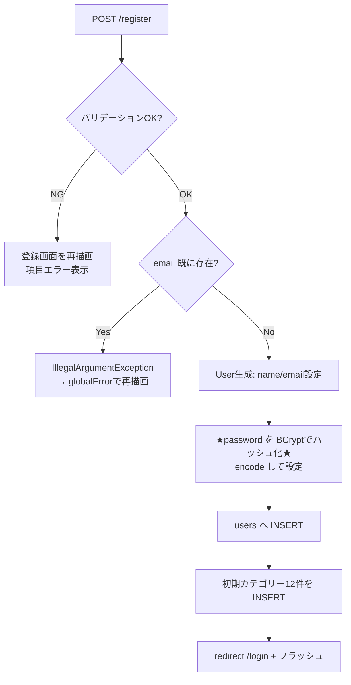
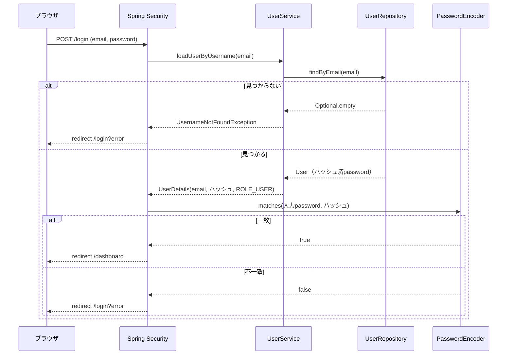
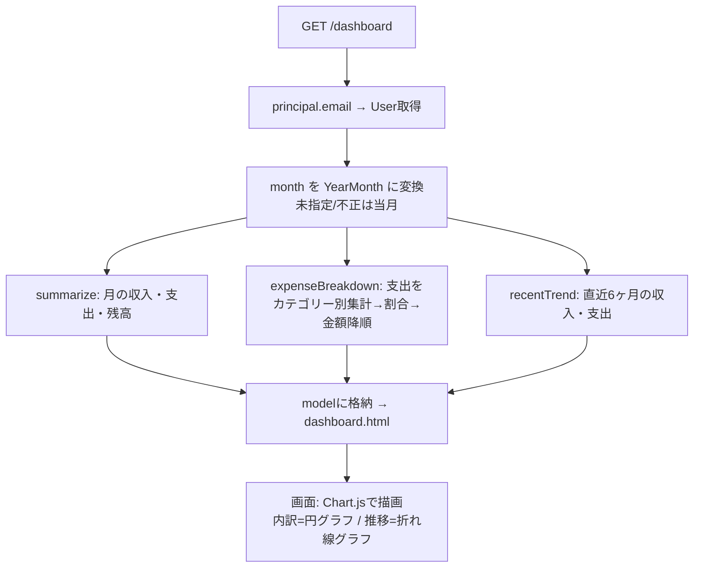
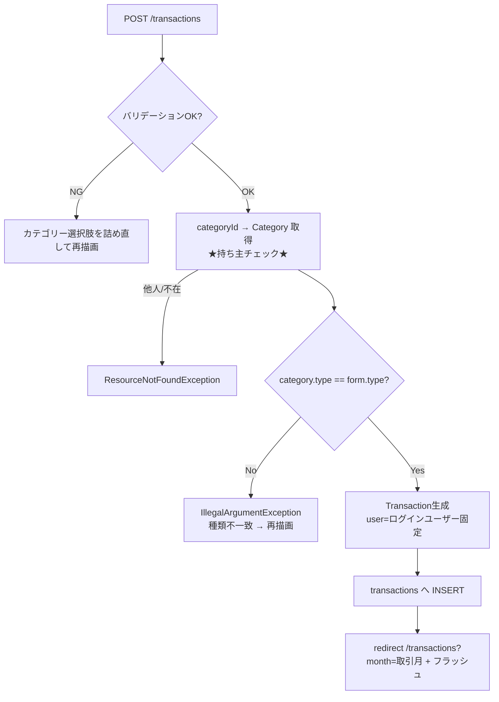
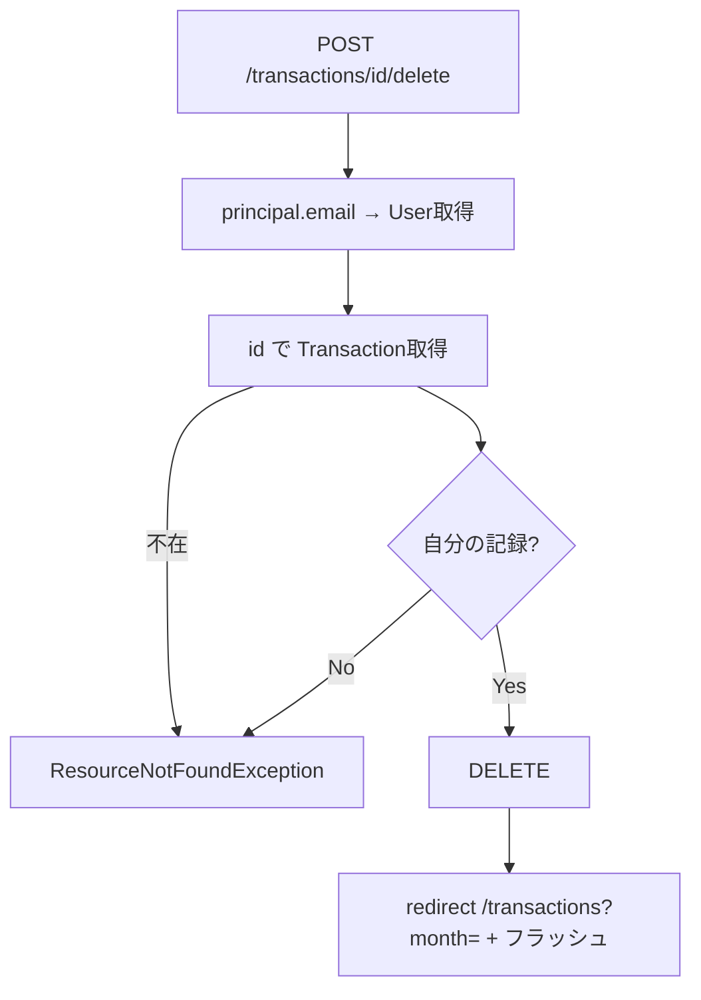
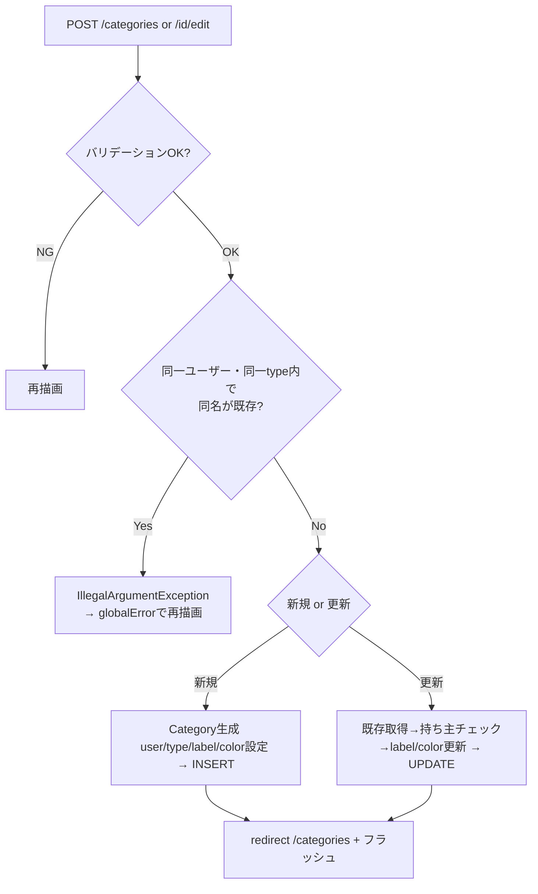
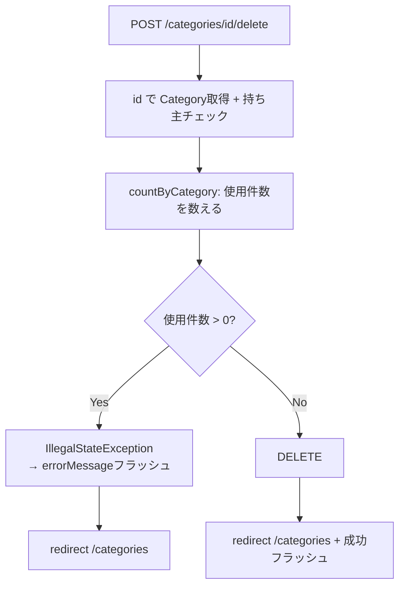
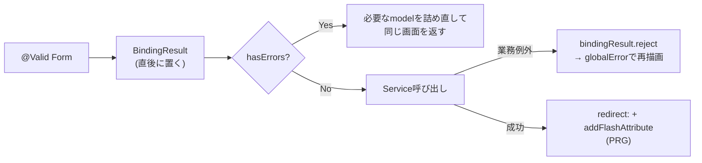

# 📐 第6章 処理設計

[← 目次に戻る](./README.md)

主要機能ごとに「入出力・処理フロー・業務ルール・例外」を定義する。
機能IDは [03_機能一覧.md](./03_機能一覧.md) と対応。

---

## 6-1. FNC-05 利用者登録

| 項目 | 内容 |
| ---- | ---- |
| 入力 | `UserRegisterForm`（name, email, password） |
| 出力 | 成功→`/login` リダイレクト＋フラッシュ／失敗→登録画面再描画 |
| 担当 | UserRegisterController#register → UserService#register |

### 処理フロー



### 業務ルール
- email はDB UNIQUE ＋ Service の `existsByEmail` で**二段構え**の重複防止
- パスワードは**必ず** `passwordEncoder.encode()` を通す（生保存は禁止）
- 登録成功時、当該ユーザーに初期カテゴリー12件（[04_DB設計 4-4-1](./04_DB設計.md)）を作成

---

## 6-2. FNC-02 ログイン認証（Spring Security）



### ポイント
- `usernameParameter("email")` により input[name=email] をユーザー名として扱う
- パスワード照合（`matches`）は **Security内部** が実施。アプリは「ハッシュを渡すだけ」
- ハッシュを**生に戻す処理は存在しない**（不可逆）

---

## 6-3. FNC-06 ダッシュボード表示（集計）

| 入力 | `?month=`（任意）、認証情報 |
| ---- | ---- |
| 出力 | summary / breakdown / trend / availableMonths / selectedMonth |

### 処理フロー



### 集計ロジック詳細

| 集計 | 内容 |
| ---- | ---- |
| summarize | 月範囲の記録を取得し、type で income/expense に振り分けて合計。balance = income − expense |
| expenseBreakdown | 支出のみカテゴリー別に合計 → 各 `percentage = round(amount×100/支出合計)`（合計0なら0）→ 金額降順ソート |
| recentTrend | 当月含む過去6ヶ月、各月で summarize を呼び label="N月" でリスト化 |

### グラフ描画（画面側 / Chart.js）

| グラフ | 種類 | データ元 | 描画 |
| ------ | ---- | -------- | ---- |
| 支出の内訳 | 円グラフ（doughnut） | `breakdown` | ラベル=label / 値=amount / 色=color。0件時は案内表示し canvas を出さない |
| 直近6ヶ月の推移 | 折れ線（line, 2系列） | `trend` | 収入(緑)・支出(赤)。縦軸は Chart.js が自動スケール |

> サーバーは集計値（DTO）を `model` に渡すだけ。描画は `dashboard.html` 内の Chart.js が
> `th:inline="javascript"` でJSON化されたデータを受け取って行う。

### 月範囲取得（共通）
```text
start = YearMonth.atDay(1)        … 月初
end   = YearMonth.atEndOfMonth()  … 月末
→ findByUserAndTransactionDateBetween...(user, start, end)  ※Betweenは両端含む
```

---

## 6-4. FNC-09 記録登録

| 入力 | `TransactionForm`（type, transactionDate, categoryId, amount, memo）、認証情報 |
| 出力 | 成功→`/transactions?month=取引月`／失敗→記録フォーム再描画 |

### 処理フロー



### 業務ルール
- `categoryId(Long) → Category` への変換は **Service** が実施（`findOwnedById`）
- 同時に「自分のカテゴリーか」を検証（他人のIDを送られても弾く）
- 記録の type とカテゴリーの type は一致必須
- `user` は **必ずログイン中ユーザー**（Formの値は信用しない）

---

## 6-5. FNC-10 記録削除



業務ルール：**削除は必ず POST**。他人の記録は「不在」と同じ扱いで拒否。

---

## 6-6. FNC-13 / FNC-15 カテゴリー登録・更新



### 業務ルール
- 重複チェック：同一 user ＋ type 内で label 重複不可（`existsByUserAndTypeAndLabel`）
- **更新では type は変更しない**（既存記録との整合を保つ。label / color のみ）
- 更新時は `findOwnedById` で持ち主チェック

---

## 6-7. FNC-16 カテゴリー削除（使用中チェック）



### 業務ルール
- 「使われていたら削除不可」は**業務判定＝Service**、「数える/消す」は**Repository**
- 使用中の場合は赤バナー（`errorMessage`）で理由を表示（件数付き）

---

## 6-8. 共通処理パターン

### バリデーション → 再描画（更新系POST共通）



| 規約 | 内容 |
| ---- | ---- |
| `BindingResult` の位置 | `@Valid` 引数の**直後**（順序厳守） |
| 再描画時 | GET時に詰めた選択肢（categories等）を**詰め直す** |
| 業務例外 | `IllegalArgumentException` を `reject` でフォームエラー化 |
| 成功 | **必ず redirect（PRG）**＋フラッシュメッセージ |

---

[← 05 クラス設計](./05_クラス設計.md) ｜ [次へ：07 バリデーション定義 →](./07_バリデーション定義.md)
