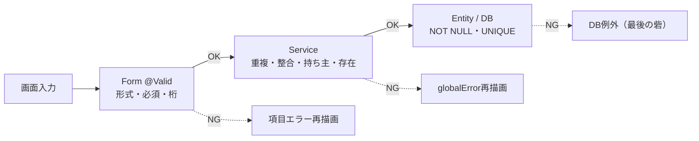

# 📐 第7章 バリデーション定義

[← 目次に戻る](./README.md)

各 Form の項目ごとのチェック内容を定義する。
- **Form（画面）チェック**：Jakarta Bean Validation（`@Valid` で発動、項目別にエラー表示）
- **Service（業務）チェック**：DB問い合わせが必要な検証（重複・整合・存在）
- **DB（整合）チェック**：NOT NULL / UNIQUE（最後の砦）

メッセージ文言は [08_メッセージ一覧.md](./08_メッセージ一覧.md) を参照。

---

## 7-1. 項目別チェックの考え方

| アノテーション | 弾くもの                       | 適用する型     |
| -------------- | ------------------------------ | -------------- |
| `@NotBlank`    | null・空文字・空白のみ         | String         |
| `@NotNull`     | null のみ                      | enum・数値・参照型 |
| `@Size(min,max)` | 文字数                       | String         |
| `@Email`       | メール形式（@を含む等）        | String         |
| `@Min`         | 数値の最小                     | 数値           |
| `@DateTimeFormat(ISO.DATE)` | 日付の入出力形式  | LocalDate（変換用） |

原則：**String は `@NotBlank`、enum/数値/参照型は `@NotNull`**。

---

## 7-2. LoginForm（SCR-01）

| 項目     | チェック             | エラーメッセージ |
| -------- | -------------------- | ---------------- |
| email    | `@NotBlank` `@Email` | メールアドレスは必須です／メールアドレスの形式が不正です |
| password | `@NotBlank`          | パスワードは必須です |

> 認証可否（存在・パスワード一致）は Spring Security の担当（[09](./09_セキュリティ設計.md)）。

---

## 7-3. UserRegisterForm（SCR-02）

| 項目     | チェック                       | エラーメッセージ |
| -------- | ------------------------------ | ---------------- |
| name     | `@NotBlank` `@Size(max=100)`   | ユーザー名は必須です／ユーザー名は100文字以内で入力してください |
| email    | `@NotBlank` `@Email` `@Size(max=255)` | メールアドレスは必須です／メールアドレスの形式が不正です／メールアドレスは255文字以内で入力してください |
| password | `@NotBlank` `@Size(min=6,max=255)` | パスワードは必須です／パスワードは6文字以上で入力してください |

### Service（業務）チェック
| 検証          | 方法                         | 違反時 |
| ------------- | ---------------------------- | ------ |
| email 重複    | `userRepository.existsByEmail` | IllegalArgumentException（globalError） |

> パスワード「6文字以上」は**業務ルール**のため Form 側に置く（Entity/DBには課さない）。

---

## 7-4. CategoryForm（SCR-07）

| 項目  | チェック                     | エラーメッセージ |
| ----- | ---------------------------- | ---------------- |
| id    | （なし）                     | 新規時はnullが正常 |
| type  | `@NotNull`                   | 種類（支出/収入）は必須です |
| label | `@NotBlank` `@Size(max=100)` | カテゴリー名は必須です／カテゴリー名は100文字以内で入力してください |
| color | `@NotBlank` `@Size(max=20)`  | 色は必須です／色の指定が不正です |

### Service（業務）チェック
| 検証 | 方法 | 違反時 |
| ---- | ---- | ------ |
| 同名重複（同一user・同一type内） | `existsByUserAndTypeAndLabel` | IllegalArgumentException |
| 持ち主一致（編集・削除） | `findOwnedById` | ResourceNotFoundException |

---

## 7-5. TransactionForm（SCR-05）

| 項目            | チェック                          | エラーメッセージ |
| --------------- | --------------------------------- | ---------------- |
| type            | `@NotNull`                        | 種類（支出/収入）は必須です |
| transactionDate | `@NotNull` `@DateTimeFormat(ISO.DATE)` | 日付は必須です |
| categoryId      | `@NotNull`                        | カテゴリーは必須です |
| amount          | `@NotNull` `@Min(1)`              | 金額は必須です／金額は1円以上で入力してください |
| memo            | `@Size(max=255)`（任意）          | メモは255文字以内で入力してください |

### Service（業務）チェック
| 検証 | 方法 | 違反時 |
| ---- | ---- | ------ |
| カテゴリー存在＋持ち主一致 | `findOwnedById` | ResourceNotFoundException |
| 記録typeとカテゴリーtype一致 | Service内比較 | IllegalArgumentException（種類不一致） |

---

## 7-6. 三層バリデーションの全体像

| 層 | チェックの性質           | 例 |
| -- | ------------------------ | -- |
| Form | 1項目で完結する形式チェック | 必須・桁・email形式・1円以上 |
| Service | DB問い合わせが要る判断   | email重複・カテゴリー重複・持ち主・type整合 |
| DB | 整合性の最後の砦          | UNIQUE(email)・NOT NULL |

---

[← 06 処理設計](./06_処理設計.md) ｜ [次へ：08 メッセージ一覧 →](./08_メッセージ一覧.md)
