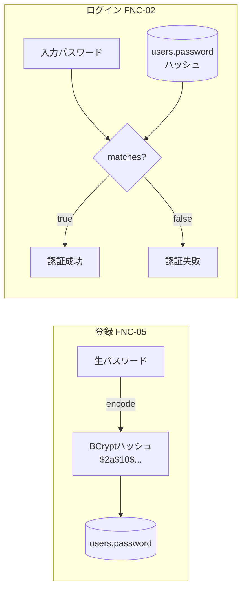
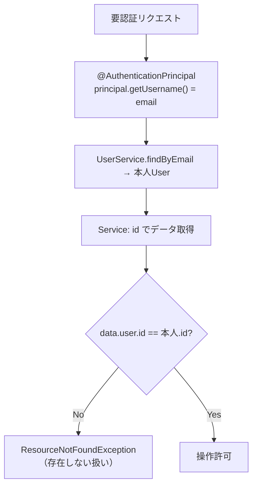

# 📐 第9章 セキュリティ設計

[← 目次に戻る](./README.md)

本システムは個人の金銭データを扱うため、セキュリティ設計を独立章として定義する。

---

## 9-1. セキュリティ要件サマリー

| # | 要件 | 実現方法 |
| - | ---- | -------- |
| 1 | パスワードを平文で保存しない | BCryptでハッシュ化（`PasswordEncoder`） |
| 2 | 他人のデータを閲覧・操作させない | Serviceの持ち主チェック ＋ 認証情報からの本人特定 |
| 3 | なりすまし入力を防ぐ | ログイン中ユーザーはURLでなく`@AuthenticationPrincipal`から取得 |
| 4 | 改ざんリクエストを防ぐ | CSRFトークン（Thymeleaf自動挿入） |
| 5 | 未認証アクセスを防ぐ | `SecurityFilterChain` の認可設定 |

---

## 9-2. 認証方式

| 項目             | 設計 |
| ---------------- | ---- |
| 方式             | フォーム認証（HTMLフォームで email＋password を POST） |
| ログインID       | email（`usernameParameter("email")`） |
| 認証窓口         | `UserService implements UserDetailsService` |
| パスワード照合   | `BCryptPasswordEncoder.matches()`（Security内部） |
| 権限（ロール）   | 全ユーザー `ROLE_USER` |
| 成功時遷移       | `/dashboard`（常に） |
| 失敗時遷移       | `/login?error` |
| ログアウト       | POST `/logout` → `/login?logout` |

> `UserDetailsService` 実装と `PasswordEncoder` Bean があれば、Spring Security が
> 認証プロバイダを**自動構築**する（SecurityConfig に明示記述は不要）。

---

## 9-3. ★パスワードのハッシュ化★

| 規約 | 内容 |
| ---- | ---- |
| アルゴリズム | BCrypt（salt自動付与・一方向・計算コスト高） |
| 保存値       | ハッシュ文字列のみ（約60文字）。**生パスワードはDBにもログにも残さない** |
| 照合         | `matches(生, ハッシュ)`。ハッシュを生に戻す処理は**作らない（不可逆）** |
| 実装位置     | ハッシュ化は `UserService.register`（Serviceの責務） |

---

## 9-4. 認可マトリクス（URL × アクセス可否）

| URLパターン        | 未認証 | 認証済 | 設定 |
| ------------------ | ------ | ------ | ---- |
| `/login`           | ○      | ○      | permitAll |
| `/register`        | ○      | ○      | permitAll |
| `/css/**` `/js/**` `/images/**` | ○ | ○ | permitAll（静的資源） |
| `/`                | ×→/login | ○    | authenticated（→/dashboardへ） |
| `/dashboard`       | ×→/login | ○    | authenticated |
| `/transactions/**` | ×→/login | ○    | authenticated |
| `/categories/**`   | ×→/login | ○    | authenticated |
| `/logout`          | ―      | ○      | authenticated（POST） |

> ★設定順序★ `permitAll()` を先、`anyRequest().authenticated()` を後に書く。
> 順序を誤ると公開ページまで認証必須に飲まれる。

---

## 9-5. ★データ所有権（持ち主チェック）★

URLのidは改ざん可能なため、**「自分のデータか」を必ずServiceで検証**する。

| 対象 | チェック箇所 |
| ---- | ------------ |
| カテゴリー編集/更新/削除 | `CategoryService.findOwnedById` |
| 記録の登録（カテゴリー指定） | `CategoryService.findOwnedById`（categoryId検証） |
| 記録の削除 | `TransactionService.delete`（tx.user一致確認） |

> 他人のデータは「権限なし」ではなく**「存在しない（404）」**として返す
> （データの有無すら漏らさないため）。

---

## 9-6. CSRF対策

| 項目 | 設計 |
| ---- | ---- |
| 既定 | Spring Security の CSRF 保護は**ON** |
| トークン挿入 | Thymeleaf の `th:action` ＋ `method="post"` で hidden input を**自動挿入** |
| 注意 | `action="..."`（`th:`なし）で書くとトークン未挿入→**403** |
| 適用箇所 | 全POSTフォーム（登録・更新・削除・ログイン・ログアウト） |

### 削除操作の方針
- **削除は必ず POST**（GETリンクにしない）
- 理由：GETだとプリフェッチ・URL直打ち・ブックマークで意図せず削除が走る
- 加えて `onsubmit="return confirm(...)"` で誤操作を防止

---

## 9-7. セッション・その他

| 項目 | 設計/補足 |
| ---- | -------- |
| セッション管理 | Spring Security 既定（サーバーサイドセッション＋クッキー） |
| Open Session In View | 既定ON。テンプレートでのLAZY関連参照（`tx.category.label`）を許容 |
| XSS | Thymeleaf `th:text` は自動HTMLエスケープ |
| 機微情報のログ | パスワードはハッシュのみ。生値・ハッシュを業務ログに出力しない |

---

## 9-8. 残課題（本番強化候補・今回スコープ外）

| 項目 | 内容 |
| ---- | ---- |
| アカウントロック | 連続ログイン失敗時のロック |
| パスワードポリシー強化 | 複雑性要件・有効期限 |
| HTTPS強制・セキュリティヘッダ | HSTS / CSP 等 |
| 監査ログ | 重要操作の記録 |
| パスワードリセット | メールによる再設定フロー |

---

[← 08 メッセージ一覧](./08_メッセージ一覧.md) ｜ [次へ：10 例外処理と共通部品設計 →](./10_例外処理と共通部品設計.md)
