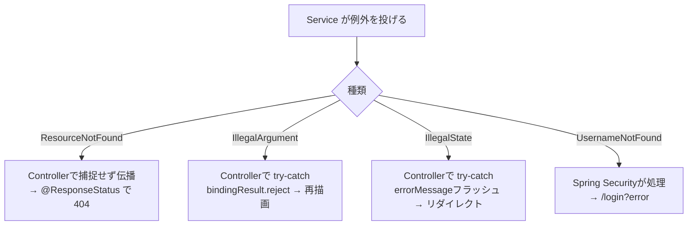

# 📐 第10章 例外処理と共通部品設計

[← 目次に戻る](./README.md)

---

## 10-1. 例外の種類と方針

| 例外                          | 意味                     | 投げる場所 | 結果 |
| ----------------------------- | ------------------------ | ---------- | ---- |
| `ResourceNotFoundException`   | 対象が存在しない／他人のもの | Service | HTTP 404（`@ResponseStatus`） |
| `IllegalArgumentException`    | 引数が不正（重複・整合違反） | Service | Controllerが捕捉→フォーム全体エラーで再描画 |
| `IllegalStateException`       | 状態が不正（使用中で削除不可） | Service | Controllerが捕捉→`errorMessage`フラッシュ |
| `UsernameNotFoundException`   | 認証時にユーザー不在     | UserService | Spring Securityが処理→`/login?error` |
| Bean Validation エラー        | 入力形式違反             | `@Valid` | `BindingResult`で項目エラー再描画 |

> 方針：**業務エラーはControllerで捕捉して画面に綺麗に出す**。404のような「無い」系のみ例外伝播でHTTPステータス化。

---

## 10-2. 例外ハンドリングの流れ

### 機能別の例外対応

| 機能 | 例外 | 対応 |
| ---- | ---- | ---- |
| FNC-05 利用者登録 | IllegalArgument（email重複） | globalErrorで登録画面再描画 |
| FNC-09 記録登録 | IllegalArgument（種類不一致） | globalErrorで記録画面再描画 |
| FNC-09/10 | ResourceNotFound（他人/不在のカテゴリー・記録） | 404 |
| FNC-13/15 カテゴリー登録/更新 | IllegalArgument（同名重複） | globalErrorで再描画 |
| FNC-16 カテゴリー削除 | IllegalState（使用中） | errorMessageフラッシュ→一覧 |

---

## 10-3. 共通部品（Thymeleafフラグメント）

`templates/fragments/layout.html` に定義し、各画面から `th:replace` で差し込む。

| フラグメント            | シグネチャ                              | 役割 |
| ----------------------- | --------------------------------------- | ---- |
| `head(title)`           | `:: head('画面名')`                     | meta・CSRF meta・Tailwind読込・タイトル |
| `fieldError(fieldName)` | `:: fieldError('email')`                | 1項目のバリデーションエラーを赤字表示 |
| `globalErrors`          | `:: globalErrors`                       | フォーム全体エラー（`reject`）を赤バナー |
| `flash`                 | `:: flash`                              | `message`（緑）/`errorMessage`（赤）表示 |
| `bottomNav(active)`     | `:: bottomNav('dashboard')`             | 下部ナビ。現在地を色付け |
| `appHeader(userName)`   | `:: appHeader(${userName})`             | 上部ヘッダー＋ログアウトPOST |

### 使用箇所マトリクス

| 画面 | head | flash | globalErrors | fieldError | bottomNav | appHeader |
| ---- | :--: | :--: | :--: | :--: | :--: | :--: |
| login | ○ | ○ | ― | ○ | ― | ― |
| register | ○ | ― | ○ | ○ | ― | ― |
| dashboard | ○ | ― | ― | ― | ○(dashboard) | ○ |
| transaction/list | ○ | ○ | ― | ― | ○(list) | ○ |
| transaction/form | ○ | ― | ○ | ○ | ○(add) | （独自ヘッダ） |
| category/list | ○ | ○ | ― | ― | ○(settings) | ○ |
| category/form | ○ | ― | ○ | ○ | ○(settings) | （独自ヘッダ） |

---

## 10-4. 画面とモデル属性の対応（キー定義）

Controllerが`model`に詰めるキーと、テンプレートでの参照を一致させる。

| 画面 | モデル属性キー | 型 | 用途 |
| ---- | -------------- | -- | ---- |
| login | `loginForm` | LoginForm | th:object |
| register | `userRegisterForm` | UserRegisterForm | th:object |
| dashboard | `userName` / `selectedMonth` / `availableMonths` / `summary` / `breakdown` / `trend` | 各種 | 表示（breakdown/trendはChart.jsへ） |
| transaction/list | `userName` / `selectedMonth` / `availableMonths` / `transactions` | List等 | 表示 |
| transaction/form | `transactionForm` / `categories` | Form / List | th:object・選択肢 |
| category/list | `userName` / `expenseCategories` / `incomeCategories` | List | 表示 |
| category/form | `categoryForm` / `isEdit` | Form / boolean | th:object・モード切替 |

> ★規約★ キー名はスペル・大文字小文字まで**Controllerとテンプレートで完全一致**させる。

---

## 10-5. 表示ユーティリティ規約

| 用途 | 実装 |
| ---- | ---- |
| 金額の3桁区切り | `#numbers.formatInteger(値, 0, 'COMMA')`、先頭に `¥` |
| 収入の符号 | `tx.type.name()=='INCOME'` のとき先頭に `+` |
| 日付整形 | `#temporals.format(tx.transactionDate, 'yyyy/MM/dd')` |
| 月ラベル整形 | `T(java.lang.Integer).parseInt(#strings.substring(m,5,7))` で先頭0除去 |
| カテゴリー色 | `th:style="'background-color:' + ${色}"`（一覧・記録フォームの色丸） |
| グラフ描画 | ダッシュボードは Chart.js（CDN）。`th:inline="javascript"` で `breakdown`/`trend` をJSON化し、円グラフ(doughnut)・折れ線グラフ(line)を生成 |

---

## 10-6. 非機能・運用上の前提（補足）

| 項目 | 設計/前提 |
| ---- | -------- |
| 文字コード | UTF-8 |
| タイムゾーン | サーバーのシステム時刻（`LocalDateTime.now()`） |
| ログ | `spring.jpa.show-sql=true`（開発用。本番は false 推奨） |
| スキーマ管理 | 学習: `ddl-auto=update`／本番: `validate` ＋ マイグレーションツール |
| 想定同時利用 | 小規模（学習用途）。負荷試験は本書スコープ外 |

---

## ✅ 詳細設計書 完了

| 章 | ファイル |
| -- | -------- |
| 0 | [README（文書概要）](./README.md) |
| 1 | [システム構成](./01_システム構成.md) |
| 2 | [画面設計](./02_画面設計.md) |
| 3 | [機能一覧](./03_機能一覧.md) |
| 4 | [DB設計](./04_DB設計.md) |
| 5 | [クラス設計](./05_クラス設計.md) |
| 6 | [処理設計](./06_処理設計.md) |
| 7 | [バリデーション定義](./07_バリデーション定義.md) |
| 8 | [メッセージ一覧](./08_メッセージ一覧.md) |
| 9 | [セキュリティ設計](./09_セキュリティ設計.md) |
| 10 | 本書（例外処理と共通部品設計） |
| 11 | [テスト設計](./11_テスト設計.md) |
| 12 | [メソッド定義書](./12_メソッド定義書.md) |

本書の内容は [`../src/main/`](../src/main) の実装と一致している。
仕様変更時は **本書と実装を同時に更新** すること。

---

[← 09 セキュリティ設計](./09_セキュリティ設計.md) ｜ [次へ：11 テスト設計 →](./11_テスト設計.md)
