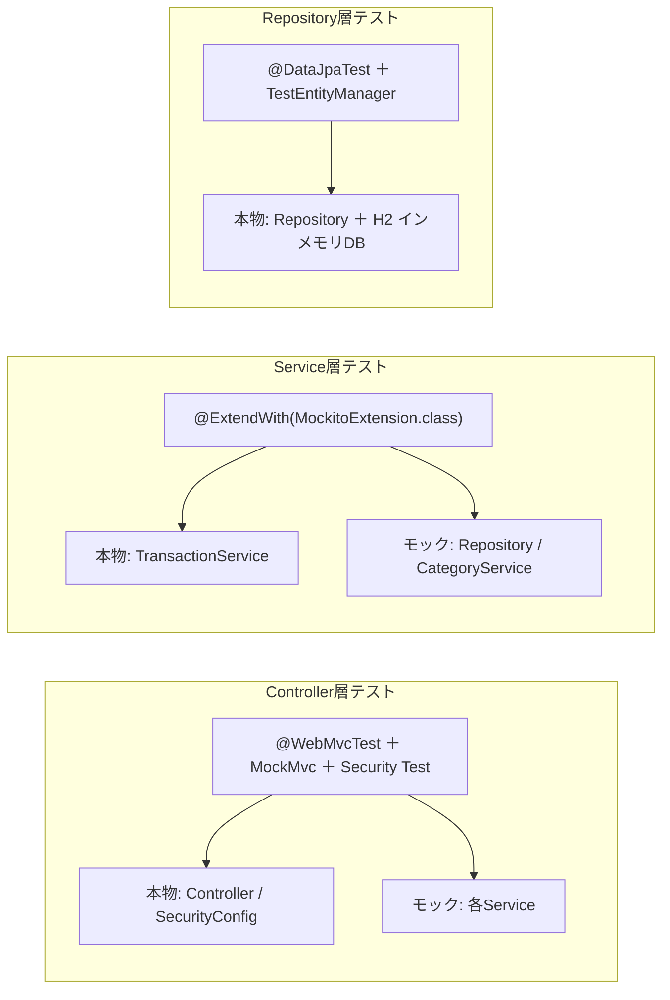

# 📐 第11章 テスト設計

[← 目次に戻る](./README.md)

本章は単体テストの **設計方針（何を・どの層で・どう検証するか）** を定義し、
層別の詳細テスト仕様書への索引とする。各ケースの詳細は末尾のリンク先を参照。

---

## 11-1. テスト方針

層ごとに Spring のテストスライスを使い分け、**責務の範囲だけ**を起動して検証する。
下の層ほど「本物」を多く使い、上の層ほど依存をモック化する。

| 層 | 対象 | 方式 | 起動範囲 | 依存の扱い |
| -- | ---- | ---- | -------- | ---------- |
| Controller | 各Controller | `@WebMvcTest` ＋ MockMvc ＋ Spring Security Test | Controller層のみ | Service を `@MockitoBean` でモック |
| Service | 業務ロジック | `@ExtendWith(MockitoExtension.class)` ＋ `@Mock` ＋ `@InjectMocks` | Spring起動なし | Repository / 依存Service をモック |
| Repository (Dao) | 派生クエリ | `@DataJpaTest` ＋ テスト用H2 ＋ `TestEntityManager` | JPA層のみ | 本物のH2に実INSERT/SELECT |

> Spring Boot 4.x（Spring Security 7）前提。Service層モックは `@MockitoBean`（旧 `@MockBean` ではない）、
> `@DataJpaTest` は `src/test/resources/application.properties` の**テスト用H2**を使う
> （`@AutoConfigureTestDatabase(replace = NONE)` で自動差し替えを止める）。

---

## 11-2. テスト構成図（層 × 本物/モック）

---

## 11-3. テストスコープ一覧（対象 × 件数）

| 層 | 対象クラス | 対応テストソース | 件数 | 詳細仕様書 |
| -- | ---------- | ---------------- | :--: | ---------- |
| Controller | HomeController | `HomeControllerTest` | 2 | [Controller層](../テスト仕様書/Controller_テスト仕様書.md) |
| Controller | LoginController | `LoginControllerTest` | 1 | 〃 |
| Controller | UserRegisterController | `UserRegisterControllerTest` | 4 | 〃 |
| Controller | TransactionController | `TransactionControllerTest` | 5 | 〃 |
| Controller | CategoryController | `CategoryControllerTest` | 8 | 〃 |
| Controller | DashboardController | `DashboardControllerTest` | 2 | 〃 |
| Service | TransactionService | `TransactionServiceTest` | 9 | [Service層](../テスト仕様書/Service_テスト仕様書.md) |
| Repository | TransactionRepository | `TransactionRepositoryTest` | 2 | [Dao層](../テスト仕様書/Dao_テスト仕様書.md) |
| | | **合計** | **33** | 全件成功 |

---

## 11-4. 詳細テスト仕様書（リンク）

各ケースの「テスト項目・検証内容・モック設定・テストデータ」は以下に定義する。

| 仕様書 | 内容 |
| ------ | ---- |
| [Controller_テスト仕様書.md](../テスト仕様書/Controller_テスト仕様書.md) | 6コントローラの表示・正常系・入力エラー・業務エラー・認可（計22件） |
| [Service_テスト仕様書.md](../テスト仕様書/Service_テスト仕様書.md) | 集計・変換・登録/削除の業務ロジックと例外（計9件） |
| [Dao_テスト仕様書.md](../テスト仕様書/Dao_テスト仕様書.md) | 派生クエリの月境界・並び順・使用件数カウント（計2件） |

---

## 11-5. テスト観点（何を検証するか）

| 層 | 主な観点 |
| -- | -------- |
| Controller | HTTPステータス／ビュー名／`model`属性／リダイレクト先／フラッシュ属性／Service呼び出し（`verify`）。加えて **認可**（未ログイン→`/login`）・**CSRF**（`.with(csrf())`）・**バリデーション再描画**・**PRG** |
| Service | 集計ロジック（`summarize`／`expenseBreakdown`（降順・収入除外）／`recentTrend`（6ヶ月・古い順））、`parseMonthOrCurrent`（不正値で落とさない）、登録/削除の業務ルール、**持ち主チェック**、例外（`IllegalArgumentException`／`ResourceNotFoundException`） |
| Repository | 派生クエリ `findByUser...Between...`（Betweenは両端含む・日付降順→ID降順）、`countByCategory`（月に依らず全件・削除前チェック用） |

> 観点は [06_処理設計.md](./06_処理設計.md)（業務ルール）・[09_セキュリティ設計.md](./09_セキュリティ設計.md)（認可・持ち主チェック）・
> [10_例外処理と共通部品設計.md](./10_例外処理と共通部品設計.md)（例外マッピング）と対応している。

---

## 11-6. 共通テストデータ

| 項目 | 値 | 用途 |
| ---- | -- | ---- |
| user | id=1／name=Akemi／email=`ake@test.com` | データの持ち主（`@WithMockUser` の username と一致） |
| カテゴリー | 食費(EXPENSE,#f87171)／交通費(EXPENSE)／給与(INCOME) | 記録の分類・内訳除外の確認 |
| 基準月 | 2026-06 | 集計・月範囲検索の基準 |

---

## 11-7. 実行結果サマリー

| 層 | テストクラス | 件数 | 結果 |
| -- | ------------ | :--: | ---- |
| Controller | Home/Login/UserRegister/Transaction/Category/Dashboard（計6） | 22 | ✅ 全件成功 |
| Service | TransactionServiceTest | 9 | ✅ 全件成功 |
| Repository | TransactionRepositoryTest | 2 | ✅ 全件成功 |
| **合計** | | **33** | **✅ 全件成功** |

> 仕様変更時は **本章・詳細テスト仕様書・テストソース（`src/test/`）を同時に更新** すること。

---

[← 10 例外処理と共通部品設計](./10_例外処理と共通部品設計.md) ｜ [目次に戻る →](./README.md)
