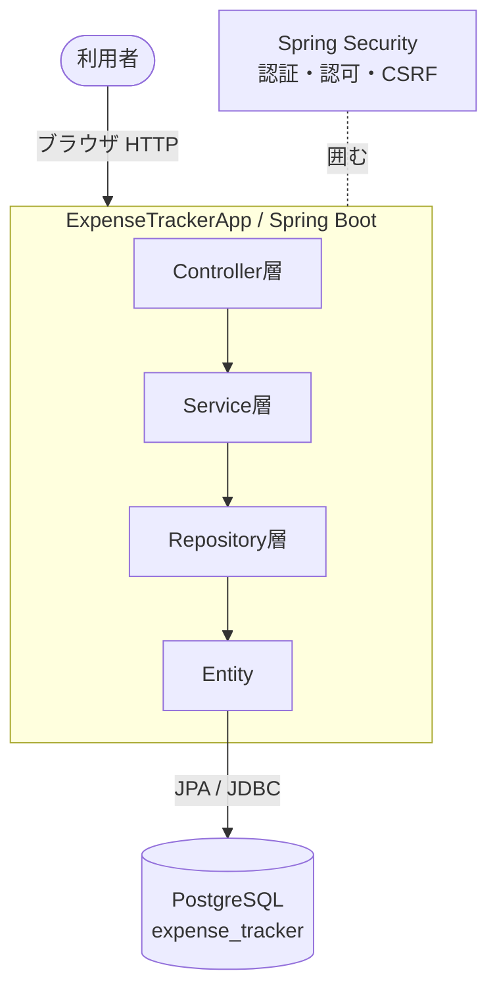

# 📐 詳細設計書 ― スマート家計簿（Spring Boot版）

本書は「スマート家計簿」アプリの **詳細設計書** です。
プログラマが本書を読めば実装できる粒度で、画面・DB・クラス・処理・バリデーション・
メッセージ・セキュリティ・例外処理を記述します。

> 学習用の解説（なぜこの順で作るか等）は [`../learn/`](../learn/README.md) を参照してください。
> 本書は「何を・どう作るか」を仕様として確定させる文書です。

---

## 📑 0-1. 文書概要

| 項目         | 内容                                                             |
| ------------ | ---------------------------------------------------------------- |
| システム名   | スマート家計簿（ExpenseTrackerApp）                              |
| 目的         | 個人の収入・支出を記録し、月次の集計（残高・内訳・推移）を可視化する |
| 対象利用者   | 一般利用者（1人1アカウント。自分のデータのみ閲覧・操作可能）      |
| 文書の位置付け | 詳細設計書（基本設計の次。コーディングの直接の根拠）            |
| 前提プラットフォーム | Java 17 / Spring Boot 4.x / PostgreSQL / Thymeleaf       |

### 参照資料

| 資料                         | 場所                                |
| ---------------------------- | ----------------------------------- |
| 学習ガイド（章別解説）       | [`../learn/`](../learn/README.md)   |
| 実装ソース                   | [`../src/main/`](../src/main)       |
| 元になったUI（React版）      | 別添（家計簿 React コンポーネント） |

---

## 📚 0-2. 本書の構成

| 章 | ファイル | 内容 |
| -- | -------- | ---- |
| 0 | 本書（README） | 文書概要・前提・用語・設計判断 |
| 1 | [01_システム構成.md](./01_システム構成.md) | 層構造・技術スタック・パッケージ構成・実行構成 |
| 2 | [02_画面設計.md](./02_画面設計.md) | 画面一覧・画面遷移図・画面ごとの項目定義 |
| 3 | [03_機能一覧.md](./03_機能一覧.md) | 機能ID／URL／Method／Controller／Service 対応 |
| 4 | [04_DB設計.md](./04_DB設計.md) | ER図・テーブル定義・制約・初期データ |
| 5 | [05_クラス設計.md](./05_クラス設計.md) | Entity／Form／DTO のクラス図・フィールド定義 |
| 6 | [06_処理設計.md](./06_処理設計.md) | 機能別の処理フロー・シーケンス・業務ルール |
| 7 | [07_バリデーション定義.md](./07_バリデーション定義.md) | 項目別チェック内容 |
| 8 | [08_メッセージ一覧.md](./08_メッセージ一覧.md) | 成功・エラー・バリデーション文言 |
| 9 | [09_セキュリティ設計.md](./09_セキュリティ設計.md) | 認可マトリクス・パスワードハッシュ化・持ち主チェック・CSRF |
| 10 | [10_例外処理と共通部品設計.md](./10_例外処理と共通部品設計.md) | 例外マッピング・共通レイアウト・フラッシュ |

---

## 🧾 0-3. 用語定義

| 用語           | 意味                                                         |
| -------------- | ------------------------------------------------------------ |
| 利用者(User)   | アカウント1件。email＋パスワードでログインする               |
| カテゴリー(Category) | 収支の分類（食費・給与など）。利用者ごと・支出/収入別に持つ |
| 記録(Transaction) | 1件の収支（いつ・いくら・どのカテゴリー・支出/収入）       |
| 種類(Type)     | 支出(EXPENSE) / 収入(INCOME) の2値                           |
| 残高           | （その月の収入合計）−（その月の支出合計）                   |
| 内訳           | その月の支出をカテゴリー別に集計したもの                     |
| 推移           | 直近6ヶ月の収入・支出の月次合計                              |

---

## 🧭 0-4. 設計方針（アーキテクチャ原則）

1. **レイヤード・アーキテクチャ**：Controller / Service / Repository / Entity を役割で分離（＋Form / DTO）
2. **画面の都合とDBの都合を分離**：画面は `Form`（`Long categoryId`）、DBは `Entity`（`Category`）
3. **判断は Service、入出力は Repository、受付は Controller**
4. **PRG（Post-Redirect-Get）**：更新系POSTの後は必ずリダイレクト
5. **セキュリティ既定**：パスワードはハッシュ化／自分のデータのみ操作可／削除はPOST

---

## ⚖️ 0-5. 設計上の判断・確定事項（スコープ）

実装に先立って確定させた仕様です。基本設計からの具体化判断を含みます。

| # | 論点 | 確定した仕様 | 理由 |
| - | ---- | ------------ | ---- |
| 1 | 記録の編集 | **不可**（登録・削除のみ） | React版踏襲。修正は「削除→再登録」 |
| 2 | カテゴリーの種類変更 | **不可**（編集では名前・色のみ変更） | 既存記録との整合を保つため |
| 3 | カテゴリー削除 | 使用中（記録あり）は**不可** | 過去記録の参照切れを防ぐ |
| 4 | 月セレクタの範囲 | **直近12ヶ月固定** | 実装簡素化。データ有無に依らず選べる |
| 5 | 推移グラフ | **直近6ヶ月固定** | React版踏襲 |
| 6 | 通貨 | 日本円・**整数**（小数なし） | 円に小数は不要 |
| 7 | 初期カテゴリー | 登録時に**12件を自動作成** | 登録直後から記録できるように |
| 8 | グラフ描画 | **Chart.js（CDN）** で 支出内訳＝円グラフ（ドーナツ）／推移＝折れ線グラフ | React版 Recharts を Chart.js で再現 |
| 9 | エラー画面 | 404は**Spring標準画面** | 専用エラー画面は今回スコープ外 |

### 今回スコープ外（将来拡張候補）

- 記録の編集機能 / カテゴリー間のデータ移行
- 予算設定・アラート / CSVエクスポート / 多通貨
- パスワードリセット（メール送信） / プロフィール編集
- 専用エラー画面・監査ログ・国際化(i18n)

---

## 🗺 0-6. 全体像（コンテキスト）

---

## ✅ 0-7. 本書の使い方

- **画面を作る人** → 02 / 07 / 08
- **DBを作る人** → 04
- **サーバーロジックを作る人** → 03 / 05 / 06 / 09 / 10
- まず全体像を掴むなら 01 → 02 → 04 → 06 の順で読むと理解が早いです。
